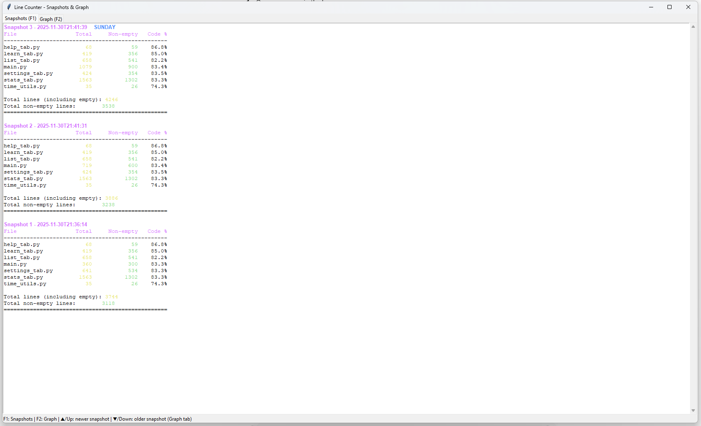
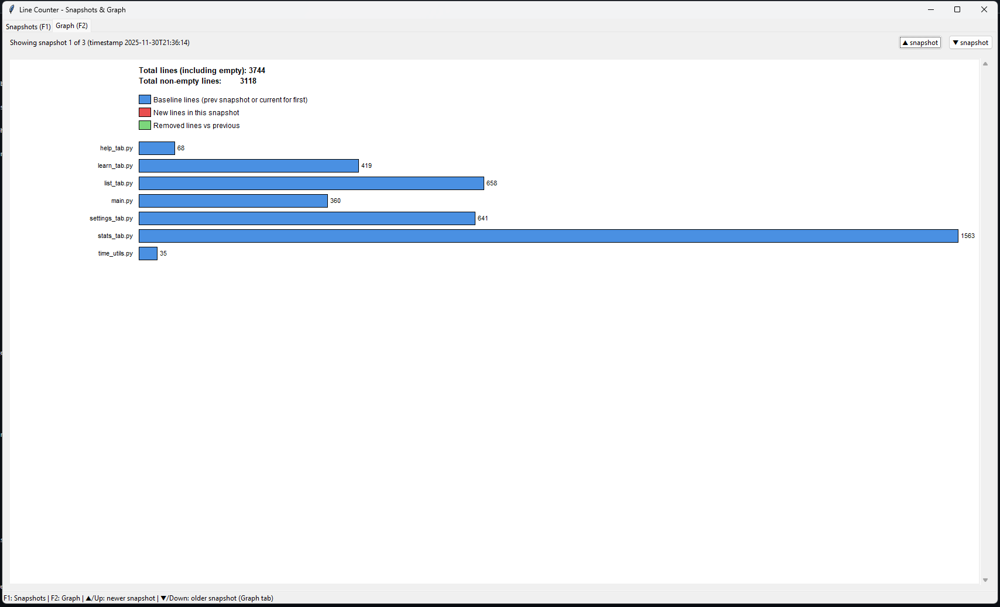
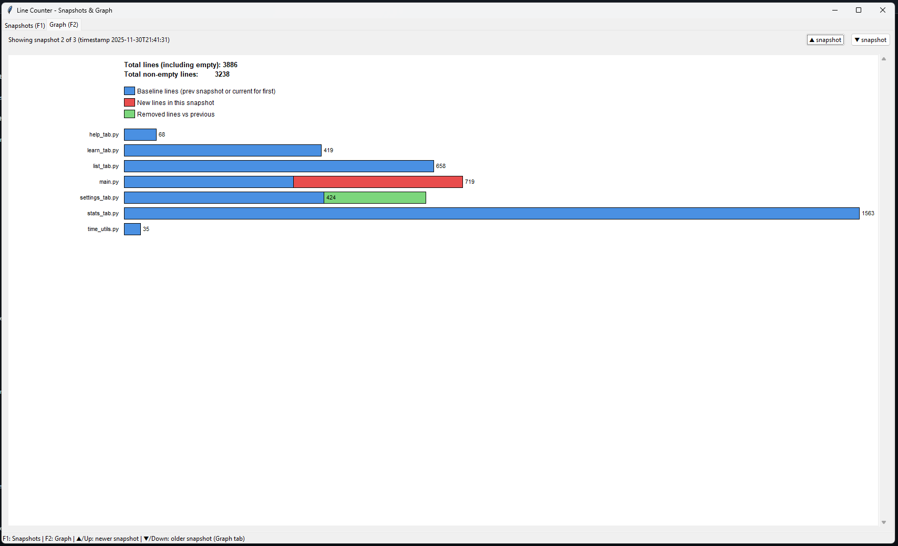
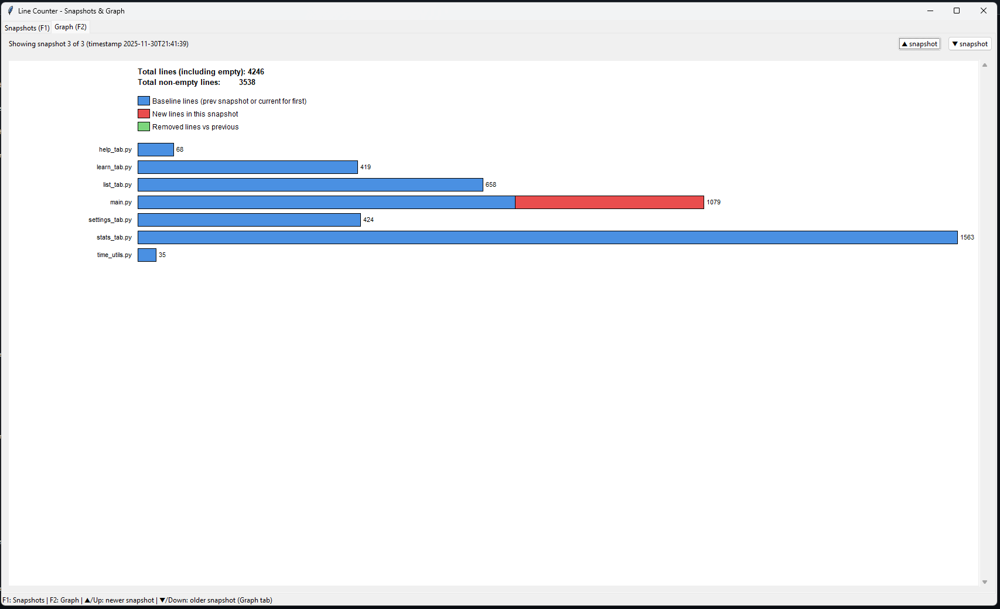

# Line Counter Snapshot Tool 🧮

A small, slightly overengineered line counter that tracks how your project grows over time.

It scans the current folder, counts lines for selected source files, saves a
**snapshot** to a local SQLite database, and shows the history in a GUI
with two tabs:

- **Snapshots** – text view of each snapshot with totals and per-file stats.
- **Graph** – horizontal bar chart per file showing how much was added or removed.

---

## Credits

- Code written by **ChatGPT** (GPT-5.1 Thinking).
- Human supervisor, button-clicker, and chaos director: **Coverfish**.
- Coverfish claims:  
  > *“I have no idea what I’m doing.”*  
  which makes this even more fun.

---

## What it does

On every run, `linecounter.py`:

1. Looks at all files in the **same folder** as itself.
2. Counts for each file:
   - total lines
   - non-empty lines
3. Saves a snapshot of those counts into `line_history.db` (SQLite).
4. Only creates a new snapshot if something actually changed since the last one.
5. Opens a GUI window with two tabs (Snapshots + Graph).

---

## Which files are counted?

Right now, these extensions are included:

```python
SUPPORTED_EXTENSIONS = {".py", ".c", ".h", ".cpp", ".hpp"}
```

That means it will count:

- Python: `.py`
- C: `.c`
- C headers: `.h`
- C++: `.cpp`
- C++ headers: `.hpp`

It also ignores `linecounter.py` itself so the tool doesn’t bloat its own stats.

If you want to support more file types, edit `SUPPORTED_EXTENSIONS` in
`linecounter.py`, for example:

```python
SUPPORTED_EXTENSIONS = {".py", ".c", ".h", ".cpp", ".hpp", ".js", ".ts", ".rs"}
```

---

## Requirements

- Python 3.10+
- Standard library only:
  - `pathlib`
  - `sqlite3`
  - `tkinter`

On some Linux distros you may need to install tkinter manually:

```bash
sudo apt install python3-tk
```

No extra `pip install` needed.

---

## Installation

```bash
git clone https://github.com/Coverfish/line-counter.git
cd line-counter
```

(Optional) Test if tkinter works:

```bash
python -m tkinter
```

If a small demo window appears, you’re good.

---

## Usage

Put `linecounter.py` into the root folder of the project you want to track
(or leave it there and move your code into the same folder).

Run:

```bash
python "python linecounter.py"
```

On each run, it will:

- Count lines in all files with supported extensions.
- Compare to the last snapshot stored in `line_history.db`.
- Create a new snapshot only if something changed.
- Open the GUI so you can browse snapshots and the graph.

`line_history.db` is created in the same folder as `linecounter.py`.

---

## License / “Legal stuff” (kind of)

This project is basically:

**Free to use in any way you see fit.**

You can:

- Copy it
- Modify it
- Use it in personal or commercial projects
- Sacrifice it to the refactoring gods

There is no warranty of any kind.
If it breaks, you get to keep both pieces.

Also:

If you somehow manage to eat the code, go ahead.
(Maybe don’t, but I can’t stop you.)

If you want a more official label, you can mentally treat this as:

> Public domain / do whatever you want.

---

## Screenshots





